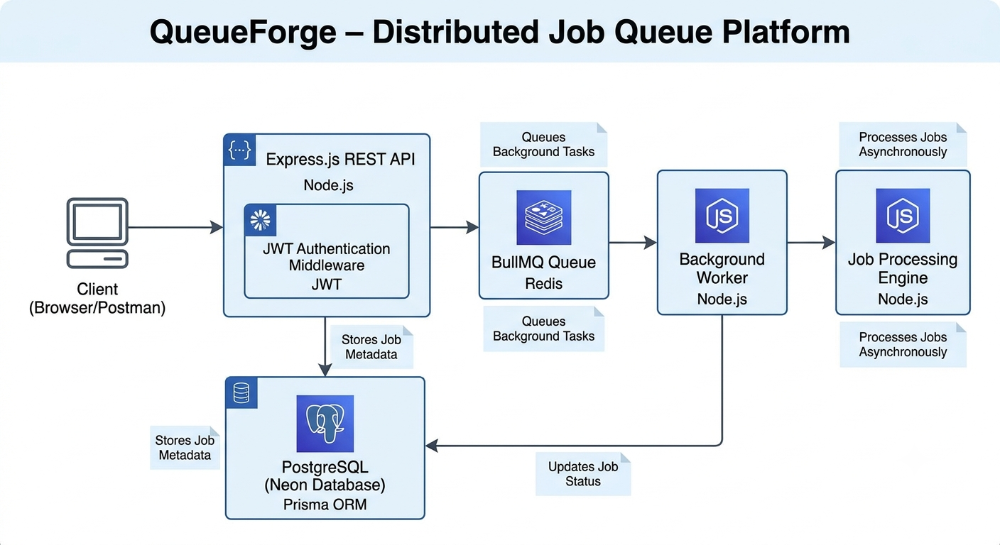
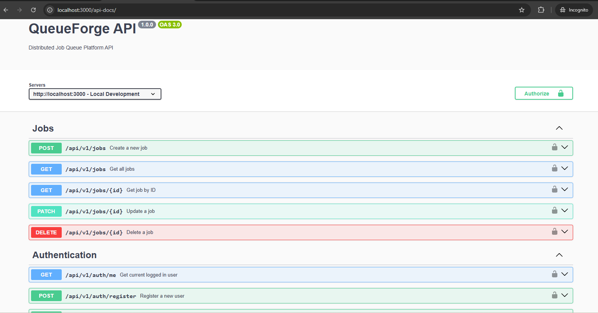
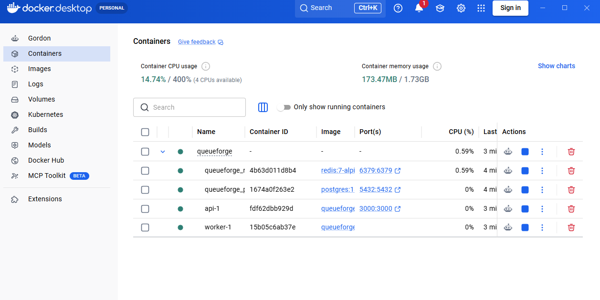
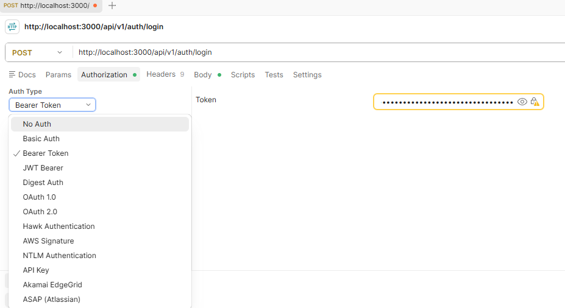
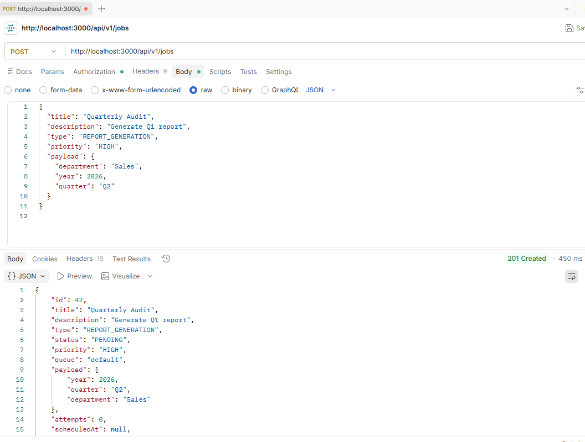
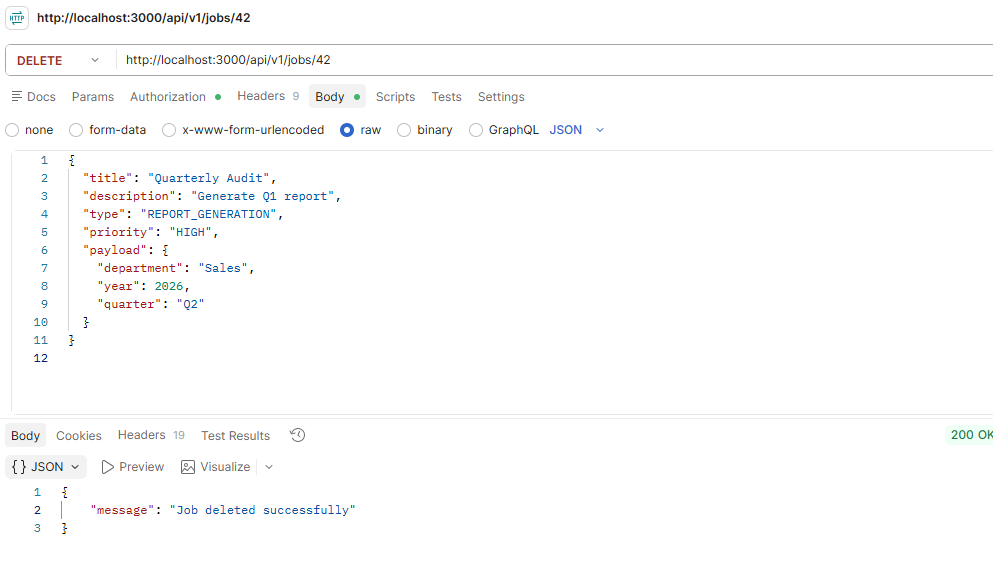
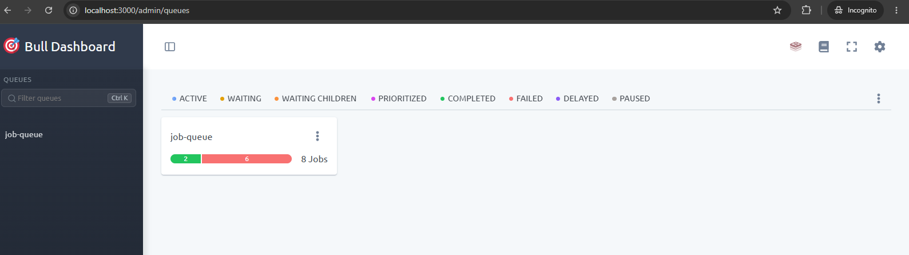
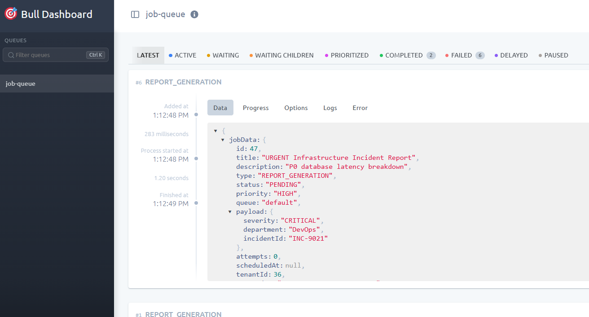

# QueueForge

> A scalable multi-tenant distributed job queue platform built using Node.js, BullMQ, Redis, PostgreSQL, and Docker.

QueueForge is a production-inspired backend system that enables asynchronous job processing for modern applications. It provides secure authentication, multi-tenant isolation, priority-based job scheduling, and distributed worker processing using BullMQ and Redis.

The platform follows an event-driven architecture where API servers focus on handling client requests while background workers process long-running tasks independently. This design improves scalability, reliability, and responsiveness.

---
#  Project Showcase

##  System Architecture

The following diagram illustrates the overall architecture of QueueForge, showing how the REST API, Redis queue, BullMQ worker, and PostgreSQL database work together to process background jobs asynchronously.

<p align="center">
    
</p>

---

##  Interactive API Documentation

QueueForge provides a fully documented REST API using Swagger (OpenAPI 3.0).

Features include:

- User Registration
- User Login
- JWT Authentication
- Create Job
- Get Jobs
- Update Job
- Delete Job

<p align="center">
    
</p>

---

##  Docker Deployment

The application is fully containerized using Docker Compose.

Running containers include:

- Express API
- Background Worker
- PostgreSQL Database
- Redis Server

<p align="center">
    
</p>

---

##  JWT Authentication

All protected endpoints require a valid JWT Bearer Token before accessing secured resources.

<p align="center">
    
</p>

---

##  Create Job API

Create a new background processing job using the REST API.

<p align="center">
    
</p>

---

##  Delete Job API

Delete an existing queued job.

<p align="center">
    
</p>

---

##  Bull Dashboard

Monitor queue statistics in real time, including waiting, active, completed, failed, delayed, and paused jobs.

<p align="center">
    
</p>

---

##  Job Details

Inspect individual jobs, including:

- Payload
- Priority
- Status
- Attempts
- Logs
- Processing Timeline

<p align="center">
    
</p>

---

## Features

- JWT Authentication
- Multi-Tenant Architecture
- Role-Based Access Control (Admin/User)
- RESTful API
- Priority Job Queue
- Asynchronous Background Processing
- BullMQ + Redis Integration
- PostgreSQL Database (Neon)
- Prisma ORM
- Swagger API Documentation
- Docker Support
- CI/CD using GitHub Actions
- Production Deployment Ready
- Structured Logging
- Error Handling Middleware

---

## Tech Stack

| Layer | Technology |
|---------|------------|
| Runtime | Node.js |
| Framework | Express.js |
| Database | PostgreSQL (Neon) |
| ORM | Prisma |
| Queue | BullMQ |
| Message Broker | Redis (Upstash/Redis) |
| Authentication | JWT |
| Validation | Zod |
| Logging | Pino |
| API Documentation | Swagger |
| CI/CD | GitHub Actions |
| Containerization | Docker |

---

## Project Structure

```
QueueForge/
│
├── prisma/
│ ├── schema.prisma
│ └── migrations/
│
├── src/
│ ├── config/
│ ├── middleware/
│ ├── modules/
│ │ ├── auth/
│ │ ├── jobs/
│ │ └── queue/
│ ├── routes/
│ ├── utils/
│ └── server.js
│
├── tests/
├── .github/workflows/
├── docker-compose.yml
├── Dockerfile
├── package.json
└── README.md
```

---

# System Architecture

```
                    Client
                       │
                       ▼
               Express REST API
                       │
       ┌───────────────┼──────────────┐
       ▼               ▼              ▼
 Authentication     PostgreSQL      Redis
    (JWT)            (Neon)       (BullMQ Queue)
                                        │
                                        ▼
                               Background Worker
                                        │
                                        ▼
                             Process Long Running Jobs
```

---

# How QueueForge Works

1. User registers and logs in.
2. JWT token is generated.
3. User creates a job.
4. Job details are stored in PostgreSQL.
5. Job ID is pushed into Redis.
6. BullMQ Worker fetches the job.
7. Worker processes the task asynchronously.
8. Job status is updated in PostgreSQL.

---

# API Features

Authentication

- Register User
- Login User

Jobs

- Create Job
- Get Job
- List Jobs
- Update Job
- Delete Job

Queue

- Priority Queue
- Retry Support
- Worker Processing

---

# Job Lifecycle

```
Pending
   │
   ▼
Processing
   │
   ▼
Completed
```

If an exception occurs

```
Pending
   │
   ▼
Processing
   │
   ▼
Failed
```

---

# Multi-Tenant Architecture

Every organization has its own isolated workspace.

```
Tenant A
 ├── Users
 ├── Jobs
 └── Queue

Tenant B
 ├── Users
 ├── Jobs
 └── Queue
```

This ensures complete logical separation of application data.

---

# Security

- JWT Authentication
- Password Hashing using bcrypt
- Input Validation using Zod
- Protected Routes
- Environment Variables
- Secure Database Connections

---

# Logging

QueueForge uses Pino logger for:

- Request Logs
- Error Logs
- Redis Events
- Queue Events
- Worker Events

---

# Running Locally

## Clone

```bash
git clone https://github.com/<username>/queueforge.git

cd queueforge
```

## Install

```bash
npm install
```

## Environment Variables

Create a `.env`

```
DATABASE_URL=

JWT_SECRET=

REDIS_HOST=

REDIS_PORT=

REDIS_PASSWORD=

PORT=3000

NODE_ENV=development
```

## Generate Prisma Client

```bash
npx prisma generate
```

## Run Migrations

```bash
npx prisma migrate dev
```

## Start API

```bash
npm run dev
```

## Start Worker

```bash
node src/modules/queue/worker.js
```

---

# Deployment

API

- Render

Database

- Neon PostgreSQL

Queue

- Upstash Redis

Worker

- Local Node.js Worker (or Render/Railway Worker)

---

# Testing

Run Jest Tests

```bash
npm test
```

---

# CI/CD

GitHub Actions automatically

- Installs Dependencies
- Generates Prisma Client
- Executes Unit Tests
- Verifies Build

on every push and pull request.

---

# Future Improvements

- Email Queue
- Scheduled Jobs
- Dead Letter Queue
- Delayed Jobs
- Rate Limiting
- Dashboard Analytics
- Queue Metrics
- WebSocket Notifications
- Kubernetes Deployment
- Horizontal Worker Scaling

---

# License

MIT License

---

# Author

**Bhuvan**

Computer Science Engineering

Backend Developer | Node.js | Distributed Systems | Cloud | REST APIs
